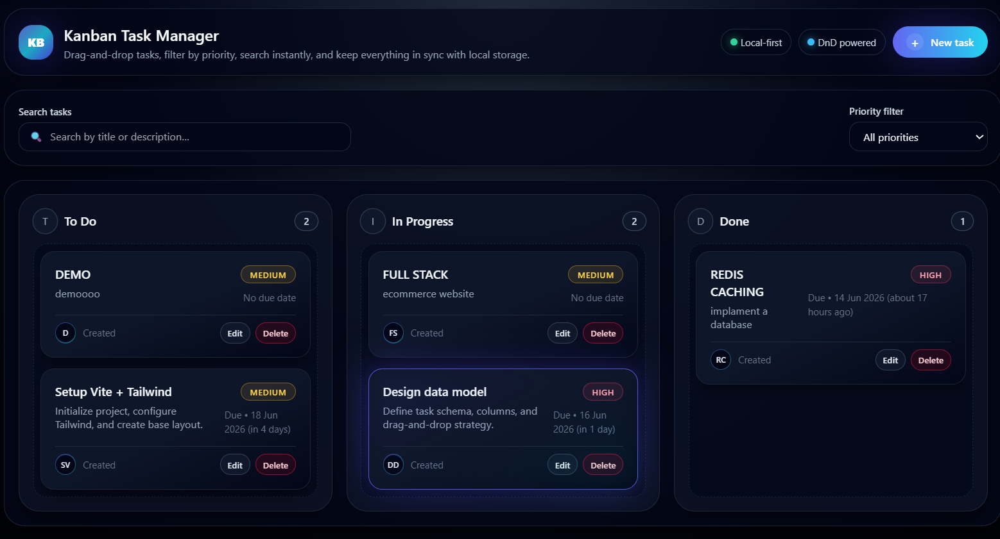
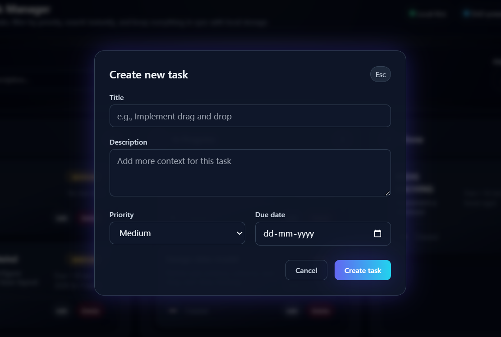
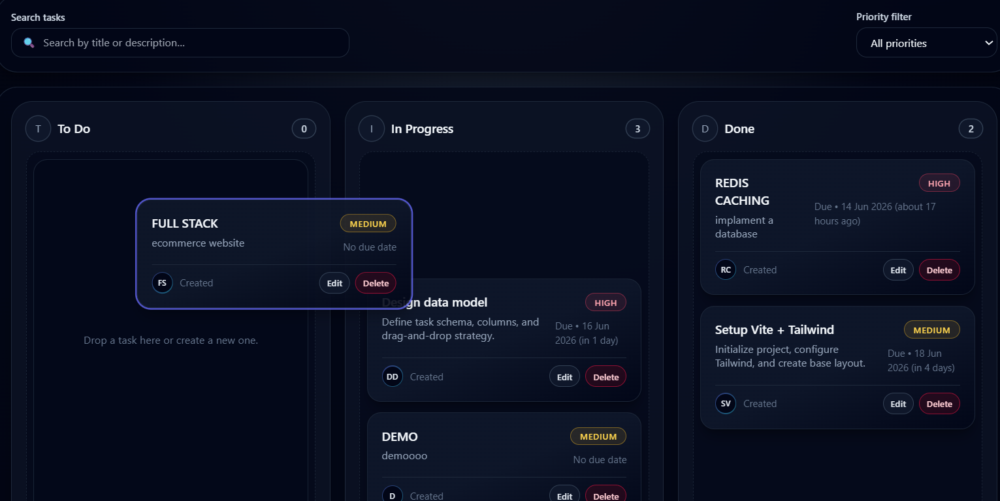

# Kanban Task Manager (React + dnd-kit + Tailwind)

This repository contains a single-page Kanban-style task manager built with React, Vite, Tailwind CSS, and the `@dnd-kit` drag-and-drop toolkit.  
The goal of the project is to provide a clean, modern, and responsive interface for managing tasks across three columns: **To Do**, **In Progress**, and **Done**. It is implemented as a purely frontend application, with all state persisted in the browser using `localStorage`, so you can use it without any backend services or databases.

The project was created as part of the Partnr Network Global Placement Program task for building a drag-and-drop Kanban board. The implementation closely follows the specification, including all required `data-testid` attributes for automated testing, and is designed to be easy to read, extend, and adapt to your own use cases or coding style.

---

## Table of Contents

- [Live Overview](#live-overview)
- [UI Screenshots](#ui-screenshots)
- [Features](#features)
- [Tech Stack](#tech-stack)
- [Project Structure](#project-structure)
- [Getting Started](#getting-started)
- [Running the App](#running-the-app)
- [Core Functional Requirements](#core-functional-requirements)
- [Implementation Details](#implementation-details)
- [Data Model and State Management](#data-model-and-state-management)
- [Drag-and-Drop Behavior](#drag-and-drop-behavior)
- [Search and Filtering](#search-and-filtering)
- [Local Storage Persistence](#local-storage-persistence)
- [Styling and UX Decisions](#styling-and-ux-decisions)
- [Testing Notes](#testing-notes)
- [Possible Improvements](#possible-improvements)
- [Acknowledgements](#acknowledgements)

---

## Live Overview

This Kanban board behaves similarly to tools like Trello, Asana, or Jira, but intentionally stays lightweight and local-first. You can:

- Create tasks with title, description, priority, and due date.
- Drag tasks between columns using intuitive drag-and-drop interactions.
- Edit and delete tasks at any time.
- Filter tasks by priority and search across titles and descriptions.
- Reload the page and keep your data thanks to local storage persistence.

The application is designed to be responsive, so it remains usable on smaller screens while still looking polished on larger desktop displays.

---

## UI Screenshots

This section showcases key parts of the interface.  
To use it, capture screenshots from your running application and save them under a `docs/` or `assets/` directory in this repository (for example, `docs/ui-board.png`). Then update the paths below to match your files. 
### 1. Main Kanban Board

This screenshot shows the overall Kanban layout with the three columns ("To Do", "In Progress", "Done"), along with the top header and filter/search bar.



### 2. Task Creation Modal

This screenshot shows the modal dialog for creating or editing a task. It demonstrates the form fields for title, description, priority, and due date.



### 3. Drag-and-Drop Interaction

This screenshot captures a task card while it is being dragged from one column to another. It highlights the drag overlay styling and the subtle glow around the active card.



---

## Features

The application supports all the required features from the project specification, plus several UX enhancements:

- **Three core columns**: To Do, In Progress, Done.
- **Create tasks** with:
  - Title
  - Description
  - Priority (low, medium, high)
  - Due date (with basic validation)
- **Edit existing tasks** in-place via a modal, with fields pre-filled.
- **Delete tasks** from any column.
- **Drag-and-drop support** to move tasks across columns and reorder them within a column.
- **Task counters** in each column header showing how many tasks currently live there.
- **Priority filter** to display tasks of a specific priority or all tasks.
- **Search input** to filter tasks by title or description in real time.
- **Local storage persistence**, so tasks and their column assignments survive page reloads.
- **Modern dark UI** with Tailwind CSS, including gradients, subtle glows, and a responsive layout.

---

## Tech Stack

The project is built with the following technologies:

- **React** (via Vite) for building the component-based UI.
- **Vite** for fast development server and build tooling.
- **Tailwind CSS** for utility-first, highly customizable styling.
- **@dnd-kit/core & @dnd-kit/sortable** for drag-and-drop interactions and sortable lists.
- **react-hook-form** for form state management and validation.
- **date-fns** for date formatting and human-friendly time descriptions. 
- **localStorage API** for frontend-only data persistence.

No backend is required for this project.

---

## Project Structure

The most important files and directories are:

- `src/App.jsx`  
  Root component that wires together the layout, filters, modal, and board.

- `src/components/KanbanBoard.jsx`  
  Encapsulates the drag-and-drop context and renders the three column components inside the DnD provider.

- `src/components/Column.jsx`  
  Renders a single column with a header, task count, and a droppable area for task cards.

- `src/components/TaskCard.jsx`  
  Renders an individual task card and integrates the draggable behavior.

- `src/components/TaskModal.jsx`  
  Implements the create/edit task form using `react-hook-form`.

- `src/hooks/useTasks.js`  
  Custom hook that centralizes task state, CRUD operations, drag-and-drop behavior, and filter/search logic.

- `src/hooks/useLocalStorage.js`  
  Custom hook that syncs the task state to `window.localStorage`.

- `src/utils/dateUtils.js`  
  Helper utilities built on top of `date-fns` for formatting due dates.

- `src/constants.js`  
  Contains constants for column IDs, priorities, and the local storage key.

- `tailwind.config.*` and `src/index.css`  
  Tailwind configuration and global styling setup.

---

## Getting Started

Follow these steps to run the project locally:

1. **Clone the repository**

   ```bash
   git clone https://github.com/lohithadamisetti123/Kanban-Task-Manager-React.git
   cd Kanban-Task-Manager-React
   ```

2. **Install dependencies**

   Make sure you have Node.js installed. Then run:

   ```bash
   npm install
   ```

   This installs React, Vite, Tailwind CSS, `@dnd-kit`, `react-hook-form`, `date-fns`, and all other dependencies.

3. **Start the development server**

   ```bash
   npm run dev
   ```

   Vite will print a local URL (typically `http://localhost:5173`). Open it in your browser to see the Kanban board.

---

## Running the App

Once the development server is running:

- You should see a dark-themed dashboard with a header, search and filter controls, and three columns.
- Click the **New task** button to open the task creation modal.
- Fill in the fields and submit to add the task to the **To Do** column.
- Drag a card to another column to move it.
- Reload the page and verify that your tasks are still present.

You can also build and preview a production build:

```bash
npm run build
npm run preview
```

---

## Core Functional Requirements

The implementation is designed to satisfy the core requirements defined in the Partnr task:

1. **Initial board render**  
   - Three columns are rendered: To Do, In Progress, Done.
   - Each column has a specific `data-testid`:
     - `column-todo`
     - `column-in-progress`
     - `column-done`

2. **Create task form**  
   - Button to open the form: `data-testid="add-task-button"`.
   - Form fields:
     - Title: `task-title-input`
     - Description: `task-description-input`
     - Priority select: `task-priority-select`
     - Due date: `task-duedate-input`
     - Submit: `task-submit-button`

3. **Create task behavior**  
   - Newly created tasks appear in the "To Do" column.
   - Task cards use a root `data-testid` like `task-card-<id>`.

4. **Drag-and-drop movement**  
   - Tasks can be dragged from one column to another using `@dnd-kit`.
   - Dropping a task updates its column and the DOM structure.

5. **Edit task**  
   - Each card includes an edit button: `edit-task-button`.
   - Clicking it opens a pre-filled modal.
   - Saving updates the card’s title and other properties in place.

6. **Delete task**  
   - Each card includes a delete button: `delete-task-button`.
   - Clicking it removes the task completely from the board.

7. **Column task counters**  
   - Each column header shows a counter:
     - `column-counter-todo`
     - `column-counter-in-progress`
     - `column-counter-done`

8. **Priority filter**  
   - Global priority filter with `data-testid="priority-filter"`.
   - Options: low, medium, high, and an “all” state.
   - Only tasks matching the selected priority remain visible.

9. **Search input**  
   - Global search field: `data-testid="search-input"`.
   - Filters tasks by title or description in real time.

10. **Local storage persistence**  
   - Tasks and column assignments are stored in `localStorage` under a consistent key.
   - Reloading the page preserves the state of the board.

---

## Implementation Details

A few key design decisions were made to keep the implementation clean and testable:

- **Single source of truth**  
  The entire task board is stored in a single state object keyed by column ID. This makes it simple to move tasks between columns and update counts.

- **Custom hooks for clarity**  
  `useTasks` and `useLocalStorageTasks` wrap up data logic separately from the presentation components. This keeps components smaller and easier to reason about.

- **Drag-and-drop with overlay**  
  The drag overlay is rendered using `DragOverlay` from `@dnd-kit`. The original card is hidden while dragging, avoiding visual duplication and giving a smooth, polished movement.

- **Form handling with react-hook-form**  
  The create/edit modal uses `react-hook-form`, which reduces boilerplate and allows easy validation rules.

---

## Data Model and State Management

Tasks are stored in an object shaped roughly like this:

```js
{
  "todo": [task1, task2, ...],
  "in-progress": [task3, ...],
  "done": [...],
}
```

Each task contains:

- `id`: unique string identifier.
- `title`: short text summary.
- `description`: longer description.
- `priority`: one of `low`, `medium`, `high`.
- `dueDate`: ISO string or `null`.
- `createdAt`: ISO timestamp of creation.

The `useTasks` hook exposes functions to:

- Create tasks.
- Update tasks by ID.
- Delete tasks by ID.
- Move tasks between columns.
- Reorder tasks inside a column.
- Apply filters and search before rendering.

---

## Drag-and-Drop Behavior

Drag and drop is powered by `@dnd-kit/core` and `@dnd-kit/sortable`.

- `DndContext` wraps the entire board.
- Each column is a **droppable** area.
- Each task card is **draggable**, with its ID used as the drag identifier.
- The `onDragEnd` handler checks where the card was dropped and updates the task state accordingly.
- A `DragOverlay` renders a floating copy of the card while dragging, giving visual feedback and avoiding duplicates.

This setup keeps drag logic centralized and makes it easier to tweak the behavior later if needed.

---

## Search and Filtering

Filtering is implemented as **derived state** from the main tasks object:

- The **priority filter** keeps tasks that match the selected priority or all tasks when in the “all” state.
- The **search input** matches against both title and description in a case-insensitive way.

The original task data is never mutated by filters. Instead, the filtering runs at render time using memoized selectors so that performance remains acceptable even with multiple tasks.

---

## Local Storage Persistence

The `useLocalStorageTasks` hook takes care of reading and writing the board state to `window.localStorage`:

- On first load, it checks for an existing item under a predefined key (for example, `"kanban-tasks"`).
- If found, it parses and uses that value; otherwise, it falls back to an initial sample board.
- Every time the task state changes, the hook serializes it back into local storage.

This approach ensures that users can safely refresh or close/reopen the tab without losing their tasks.

---

## Styling and UX Decisions

The UI is intentionally modern and visually rich:

- Dark background with radial gradients for depth.
- Rounded corners, subtle borders, and shadows to separate elements.
- Soft glows and color accents around active or hovered elements.
- Responsive layout using Tailwind’s grid utilities, so the board remains usable on mobile devices.
- Scrollbars are styled to be unobtrusive but still visible.

Tailwind CSS was chosen because it allows rapid experimentation with design while keeping the component code declarative and consistent.

---

## Testing Notes

The project is structured with automated evaluation in mind:

- All **required `data-testid` attributes** are present on:
  - Column containers
  - Task counters
  - Form elements
  - Buttons and task cards
- The **local storage key** is stable and easy to assert in tests.
- Drag and drop can be simulated with tools like Playwright or Cypress by targeting the card and column test IDs.

While no standalone test suite is included in this repository, the code is written to work with external automated test harnesses.

---

## Possible Improvements

There are several potential enhancements that could be implemented on top of this base:

- Keyboard-accessible drag-and-drop or alternative interactions for accessibility.
- Additional columns or user-customizable workflows.
- Tags, labels, or assignees for tasks.
- Different views (for example, compact view vs. detailed view).
- Synchronization with a backend or cloud storage.
- Animation refinements during drag and drop.

The current implementation focuses on meeting the core requirements cleanly while leaving room for future growth.

---

## Acknowledgements

This project makes use of documentation and examples from:

- The official React documentation.
- The `@dnd-kit` documentation and examples.
- The React Hook Form and Tailwind CSS docs.
- The Partnr Network task description, which provided a clear set of functional requirements.

If you find this project helpful, feel free to fork the repository, open issues, or adapt the code into your own workflow or tutorials.


